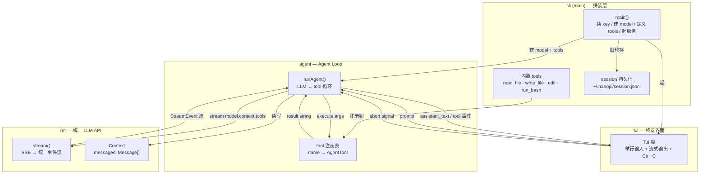
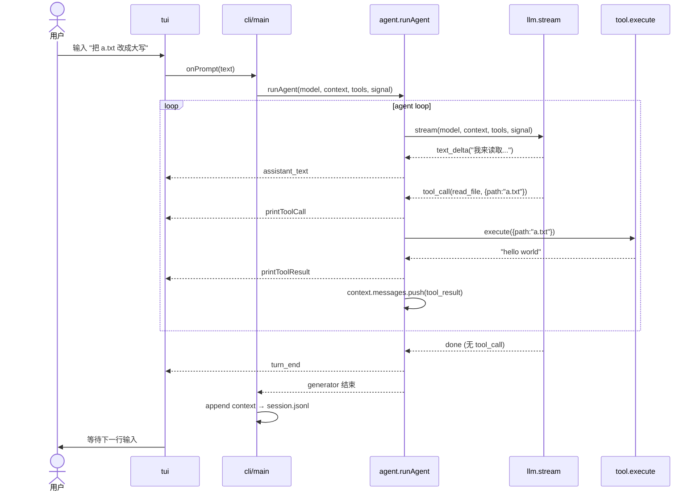

# nanopi 设计文档

> 从 0 手撕出一个 PI agent —— 极简克制教学版

## 1. 目标

让学习者通过阅读和编写尽可能少的代码，理解一个 AI coding agent 的核心是什么。
对照 pi-mono（badlogic/pi-mono，作者 Mario Zechner）的四模块架构，复刻其边界，
但每砍一刀的原则是：**这个概念是不是 "agent 是什么" 的核心**。

- 核心保留：stream / tool-call / loop / abort / max_tokens 截断处理 / tool 输出截取 / compaction
- 砍掉：多 provider 适配、TUI 渲染框架、cost tracking、context handoff、
  split tool results、slash commands、extensions、skills

pi-mono 上万行；nanopi 目标 ~700 行。

## 2. 技术选型

| 决策 | 选择 | 理由 |
|------|------|------|
| 语言 | TypeScript (Node.js) | 与 pi-mono 一致，可逐文件对照原版源码学习 |
| TUI 范围 | 极简 TUI（单行编辑 + 流式输出 + Ctrl+C 打断）| 聚焦 agent 灵魂，不碰 differential renderer |
| 模块切分 | 照搬 pi-mono 四模块 | 学完能直接读懂 pi 原版 |
| Session 持久化 | 单文件 JSONL append | ~20 行，让 "能恢复对话" 成立 |
| 内置 tool 集 | read_file / write_file / edit / run_bash | 能实际读写改代码并执行验证的最小集 |

## 3. 模块设计

### Module 1: `llm` — 统一 LLM API（对应 pi-ai）

**做什么**

- `stream(model, context, { tools, signal })` → `AsyncIterable<StreamEvent>`
- 把单个 provider（默认 OpenAI 兼容（GLM-5.2））的 SSE 响应统一成四种事件：
  `text_delta` / `tool_call` / `done` / `error`
- tool 参数用 JSON Schema 定义；模型返回 tool_call 时附带 name + args
- `AbortController` 支持：`signal.abort()` 后流终止，返回 partial result
- `Context = { messages: Message[] }`，纯 JSON，可 `JSON.stringify` 落盘

**不做什么**

- 不适配多 provider 的脏活（provider quirks 留作"扩展练习"注释）
- 不做 token / cost tracking
- 不做 thinking / reasoning 特殊处理
- 不做跨 provider context handoff
- 不做 split tool results（给 LLM 的内容 = 给 UI 看的）
- 不做 partial JSON streaming（tool args 攒完整块再解析）

**核心 API**

```typescript
type Context = { systemPrompt?: string; messages: Message[] }

type StreamEvent =
  | { type: 'text_delta'; delta: string }
  | { type: 'tool_call'; id: string; name: string; args: unknown }
  | { type: 'done'; stopReason: 'end_turn' | 'tool_use' | 'max_tokens' | 'aborted' }
  | { type: 'error'; error: Error }

function stream(model, context, opts): AsyncIterable<StreamEvent>
```

预估 ~150 行。

---

### Module 2: `agent` — Agent Loop（对应 pi-agent-core）

**做什么**

`runAgent(model, context, tools, signal)` async generator，跑 LLM ↔ tool 循环：

0. 消息过多时压缩旧消息（compaction）：让 LLM 总结前半部分，用摘要替换
1. 调 `llm.stream()`，消费事件
2. `text_delta` → yield `assistant_text` 事件
3. `tool_call` → 查 tools 注册表，执行 `tool.execute(args, signal)`，把结果作为
   `tool_result` message 塞回 context，yield `tool_call` + `tool_result` 事件
4. `done` 且无 tool_call → 循环结束；有 tool_call → 回到第 0 步
5. `max_tokens` 截断时 → 不执行 tool（参数可能不完整），把错误放回到 Context 让模型重发
6. `aborted` / `error` → 丢弃 tool_calls，结束循环

tool 注册表：`Record<string, AgentTool>`，每个 tool =
`{ name, description, parameters: JSONSchema, execute }`

**不做什么**

- 不做 state management（context 本身就是状态，agent 无状态）
- 不做 transport abstraction（直接调，不搞 proxy）
- 不做 message queuing（一次一用户消息）
- 不做 attachment（纯文本）
- 不做 max steps——loop 到模型说停为止（与 pi-mono 一致）

**核心 API**

```typescript
type AgentTool = {
  name: string;
  description: string;
  parameters: object;  // JSON Schema
  execute: (args: unknown, signal?: AbortSignal) => Promise<string>
}

type AgentEvent =
  | { type: 'assistant_text'; delta: string }
  | { type: 'tool_call'; id: string; name: string; args: unknown }
  | { type: 'tool_result'; id: string; name: string; result: string }
  | { type: 'turn_end'; stopReason: 'end_turn' | 'max_tokens' | 'aborted' | 'error' }

async function* runAgent(model, context, tools, signal): AsyncGenerator<AgentEvent>
```

预估 ~80 行。这是整个项目的灵魂——一个 while 循环。

---

### Module 3: `tui` — 极简终端界面（对应 pi-tui）

**做什么**

- 单行输入：用 Node `readline` 读一行用户 prompt
- 流式输出：`printText(delta)` 逐字追加 assistant 文本到 stdout
- tool 可视化：`printToolCall(name, args)` / `printToolResult(result)` 打印成可读行
- 打断：Ctrl+C → 触发 `onAbort` 回调，把 AbortSignal 传给 agent

**不做什么**

- 不做 differential renderer（pi-tui 的核心，但与"手撕 agent"无关）
- 不做 component 树 / retained mode
- 不做 sync output（`CSI ?2026h`）
- 不做 markdown 渲染 / 语法高亮
- 不做 autocomplete
- 不做 fullscreen / 光标控制

**核心 API**

```typescript
class Tui {
  onPrompt(cb: (text: string) => void)
  onAbort(cb: () => void)
  printText(delta: string): void
  printToolCall(name: string, args: any): void
  printToolResult(name: string, result: string): void
  start(): void
  stop(): void
}
```

预估 ~100 行。

---

### Module 4: `cli` — 拼装层（对应 pi-coding-agent）

**做什么**

- `main()`：读 `NANOPI_API_KEY` → 建 model → 定义 4 个内置 tool →
  起 TUI → 起 agent → 事件转发到 TUI
- 四个内置 tool（能读写改代码并执行验证的最小集）：
  - `read_file(path)` → 返回文件内容
  - `write_file(path, content)` → 覆盖写入文件
  - `edit(path, old_string, new_string)` → 局部字符串替换（精确匹配，失败报错）
  - `run_bash(command)` → 执行 shell 命令，返回 stdout+stderr
- session 持久化：每轮结束把 `context.messages` append 到
  `~/.nanopi/session.jsonl`
- 固定最小 system prompt（"你是一个编码助手，用工具读写文件和执行命令"）

**不做什么**

- 不做 slash commands（留作扩展）
- 不做 themes
- 不做 AGENTS.md 自动加载
- 不做 multi-provider UI 切换
- 不做 extensions / skills 机制
- 不做 compaction

预估 ~150 行（4 个 tool 各 ~20-30 行 + main ~50 行）。

## 4. `edit` tool 设计细节

局部字符串替换，与 Claude Code / pi 的 edit tool 同一范式：

```typescript
// 参数
{ path: string; old_string: string; new_string: string }

// 行为
// 1. 读文件内容
// 2. 查找 old_string 的精确匹配
// 3. 找到 0 处 → 报错 "old_string not found"
// 4. 找到 >1 处 → 报错 "old_string matches N places, must be unique"
// 5. 找到恰好 1 处 → 替换，写回文件，返回 "edited {path}: replaced N chars"
```

为什么是字符串替换而非行号替换：字符串替换让模型不需要维护行号状态，
更接近 pi 原版和 Claude Code 的 `str_replace` 语义，且教学上更直观。

## 5. 架构图



## 6. 调用时序



## 7. 代码量

| 模块 | 行数 | 对应 pi-mono 包 |
|------|------|-----------------|
| llm | ~266 | pi-ai |
| agent | ~168 | pi-agent-core |
| tui | ~88 | pi-tui |
| tools | ~120 | — |
| cli | ~112 | pi-coding-agent |
| **合计** | **~754** | pi-mono 上万行 |

## 8. 砍掉的映射

| pi-mono 概念 | nanopi | 为什么砍 |
|---|---|---|
| 多 provider 适配 | 单 provider | 是"LLM API 脏活"非"agent 灵魂" |
| differential renderer | line-based stdout | TUI 框架的功课 |
| cost/token tracking | 无 | 运维，非学习 |
| context handoff | 无 | 高级特性 |
| split tool results | 无 | UI 精化 |
| session branching | 单文件 JSONL | 管理功能 |
| slash commands / extensions / skills | 无 | 扩展机制 |
| compaction | 极简版（~35 行） | 核心概念保留：context 满了要压缩。砍掉 token 估算精度/cut point 边界/split turn |
| steering messages | 无 | 高级交互模式 |
| streamFn 依赖注入 | 直接 import | DI 教软件工程，不教 agent |
| tool 参数验证 | 无（注释说明） | try/catch 被动兜底够用 |
| parallel tool 执行 | 串行 | 简化，教学版统一串行 |
| agent/turn/message 生命周期事件 | 无 | nanopi 4 种事件够用 |
| AgentMessage → Message 转换层 | 无 | context.messages 直接是 LLM 格式 |
| toolCallId / onUpdate in execute | 无 | 教学版 execute 只需 args + signal |
